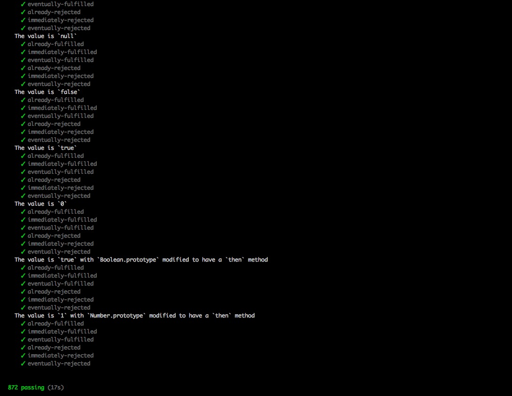

# KPromise
实现一个符合promise/A+的自定义Promise类

## 目录结构

```bash
.
├── ForPromises_A_PlusTest  用于测试KPromise是否符合"promise/A+"规范，采用commonjs的模块导出方式，代码实际上与src里并无区别
│   ├── KPromise.js         KPromise主文件入口
│   ├── constants.js        状态常量的定义
│   └── utils.js            一些工具函数
├── README.md
├── example.html            用于测试的实例页面
└── src                     采用的是ES6的模块引入规范，即（export/import）,可直接在现代浏览器中使用
    ├── KPromise.js         KPromise主文件入口
    ├── constants.js        状态常量的定义
    └── utils.js            一些工具函数

```

## 规范

​		我们要实现一个Promise类的话，需要遵循一定的规范，这样才能让使用者没有任何门槛的像在使用原生的Promise一样的使用自定义的Promise,而这个规范就是 `promise/A+` 规范。关于 `promise/A+` 的详细内容，可以到 [promiseaplus.com](https://promisesaplus.com/) 阅读其文档。

## promise/A+ 测试通过



